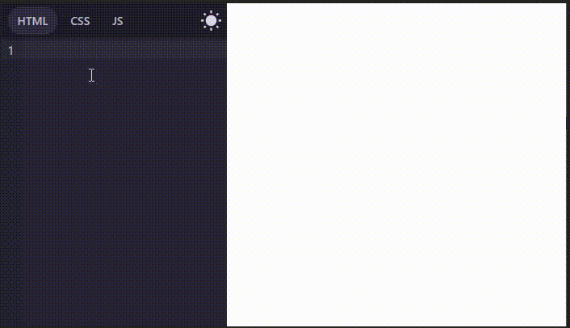
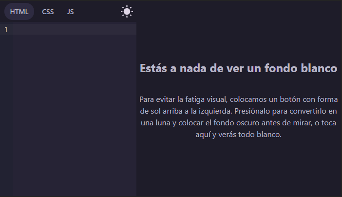

# react-haku-code-lab

CodeLab is a react component that creates a code editor with real-time preview, mainly focused on learning sites to place sample code and allow students to practice as they are learning.

## [Usage](#usage-1)

## [Params](#params-1)



## Usage

```tsx
const Component = () =>{
	
	return (
		<div>
			<CodeLab langs={["html", "css", "js"]} defaultLangSelected="html" />
		</div>
	)
}
```



## Params

- `langs`
    
    Receives an array of the languages that will be available in the editor
    
    example 1: `langs={[”html”, “css”, “js”]}` this will enable all three languages
    
    in the editor
    
    Example 2: `langs={[”html”, “css”]}` this will only enable html and css 
    
- `readonly`
    
    Accept an array with the languages that will be read-only.
    
    example: `readonly={[”html”,”js”]}` this will cause html and css to have the default value given to them and this cannot be edited, if no value was given, the fields cannot be edited in the editor either
    
- `theme`
    
    Accepts a theme for the code editor, by default it has synthwave84, but it accepts any other theme created with [code mirror theme editor](https://uiwjs.github.io/react-codemirror/#/editor/theme/single), you can see a list with some compatible themes [here](https://uiwjs.github.io/react-codemirror/#/theme/home)
    
    Example: 
    
    ```tsx
    import {dracula} from "@uiw/codemirror-theme-dracula"
    const Component = () =>{
    	
    	return (
    		<div>
    			<CodeLab 
    				langs={["html", "css", "js"]} 
    				defaultLangSelected="html" 
    				theme={dracula}
    			/>
    		</div>
    	)
    }
    ```
    
    
    
- `defaultLangSelected`
    
    receives the default language selected in the editor
    
    example: `defaultLangSelected=”html”`
    
- `startInDarkTheme`
    
    sets whether the default theme will be dark, it defaults to false.
    
    This sets the preview color to a dark shade or leaves it white. When set to white a legend will appear warning that a white background will be displayed which when clicked will set the background to white with a 5 second transition to avoid eyestrain.
    
    example: `startInDarkTheme={false}`  
    
    
    
    By clicking
    
    
    
    example 2  `startInDarkTheme={true}`  
    
    
    
- `darkLegendTitle` and `darkLegendDescription`
    
    are respectively the title and caption that will be displayed when startInDarkTheme is false before the white background is set.
    
    Example: 
    
    ```tsx
    <CodeLab
        langs={["html", "css", "js"]}
        defaultLangSelected="html"
        darkLegendTitle="A title"
        darkLegendDescription="A description"
        startInDarkTheme={false}
    />  
    ```
    


- `html`, `css` and `js`
    
    The preloaded code to be displayed by default in the respective views
    

- `codeLineStartInBar`
    
    Allows you to write code inside inverted quotes, where each line of code starts with a vertical bar | this allows you to identify the code that we will place by default in our html, css and js without displaying all the spaces from the left side of the editor.
    
    Example1: `codeLineStartInBar={false}` //default
    
    ```tsx
    <CodeLab
        langs={["html", "css", "js"]}
        defaultLangSelected="html"
        html={`
    			<div>
    				<h1>Hello Haku</h1>
    			</div>
    		`}
    />  
    ```
    
    
    
    Example2: `codeLineStartInBar={true}`  // starts each line with a vertical bar
    
    the vertical bars mark the beginning of each line
    
    ```tsx
    <CodeLab
        langs={["html", "css", "js"]}
        defaultLangSelected="html"
    		codeLineStartInBar={true}
        html={`
    			|<div>
    			|	  <h1>Hello Haku</h1>
    			|</div>
    		`}
    />  
    ```
    
    
    
    If for some reason you want to write a vertical bar at the beginning of the line simply place two